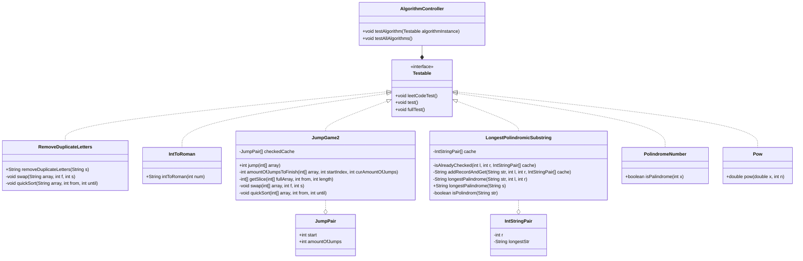

# java-unit-testing
Requires:
  - jdk-21
  - JUnit-5

Includes:
  - Multiple solved Leet Code problems
  - Testing interface Testable.java

For solving problems, implement algorithm.Testable. After creating your class paste test from LeetCode into leetCodeTest() and your own into test(), add it into testAllAlgorithms() by creating an instance of solving class. Manage tests with this method.

No license, use for whatever

